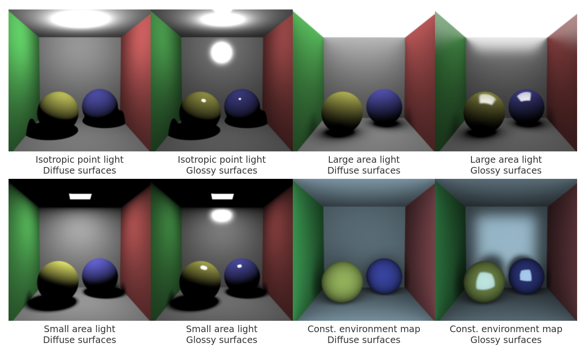

# PG3-Render

## About

PG3-Render is a minimalistic renderer. It supports rendering a static scene (Cornell box with two spheres)
using multiple-importance-sampling for direct illumination as well as path tracing.
This project mainly serves as a version control system for my homework assignments for the course "Computer Graphics III" 
tought at the Faculty of Mathemathics and Physics at Charles University in Prague.
A skeltion code was provided by Prof. Jaroslav Krivanek and can be - together with the assignemnts for the "Computer Graphics III"
course - viewed here:
https://cgg.mff.cuni.cz/~jaroslav/teaching/2018-npgr010/index.html




## Building the project

```console
mkdir build && cd build
cmake ..
make
```

## Using the renderer

Inside the 'build' directory, execute the following command for a functionality overview:
```console
./PG3Render -h
```

```console
Usage: ./PG3Render [ -s <scene_id> >| -v <volume_type> | -a <algorithm> |
          | -t <time> | -i <iteration> | -o <output_name> | --report ]

    -s  Selects the scene (default 0):
          0    walls spheres + point light + sph. diffuse walls diffuse 
          1    walls spheres + point light + sph. diffuse sph. glossy walls diffuse walls glossy 
          2    walls spheres + ceiling light + sph. diffuse walls diffuse 
          3    walls spheres + ceiling light + sph. diffuse sph. glossy walls diffuse walls glossy 
          4    walls spheres + light box + sph. diffuse walls diffuse 
          5    walls spheres + light box + sph. diffuse sph. glossy walls diffuse walls glossy 
          6    walls spheres + env. light + sph. diffuse walls diffuse 
          7    walls spheres + env. light + sph. diffuse sph. glossy walls diffuse walls glossy 
    -a  Selects the rendering algorithm (default pt):
          el   eye light
          di   direct illumination
          pt   path tracing
    -v  Optinally selects participating media type (default none)
          gh   global homogenious
          iso  isotropic
    -t  Number of seconds to run the algorithm
    -i  Number of iterations to run the algorithm (default 1)
    -o  User specified output name, with extension .bmp or .hdr (default .bmp)

    Note: Time (-t) takes precedence over iterations (-i) if both are defined

```